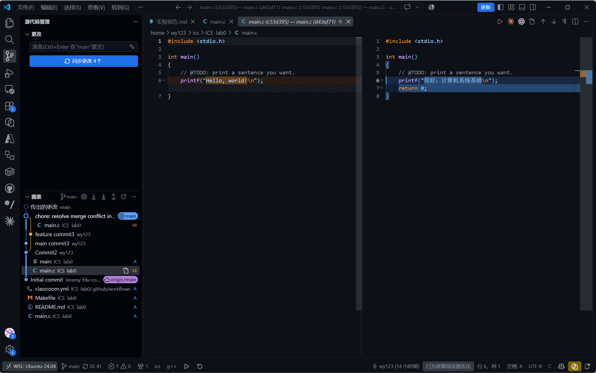
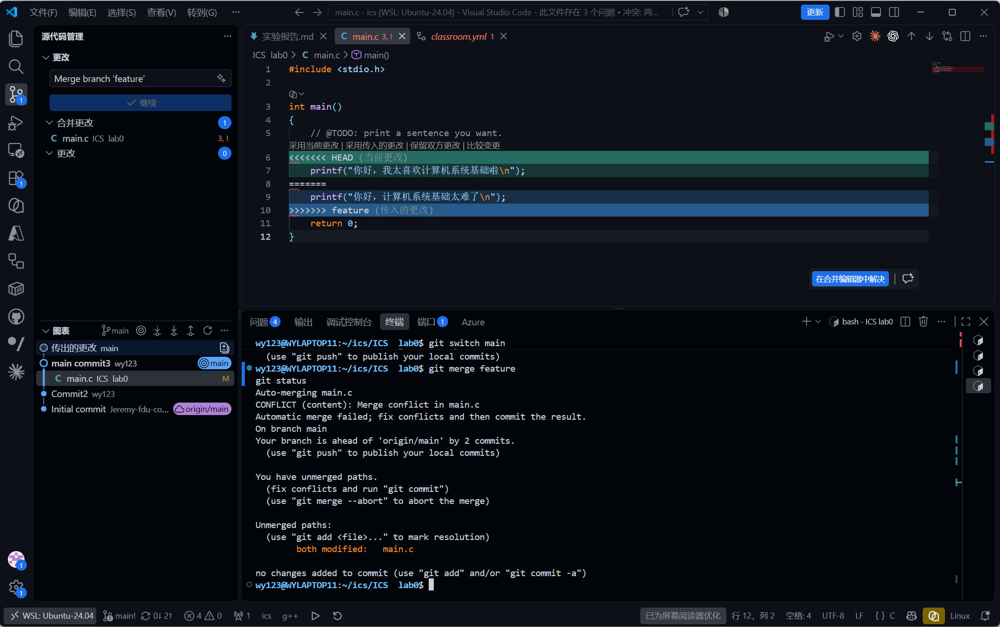
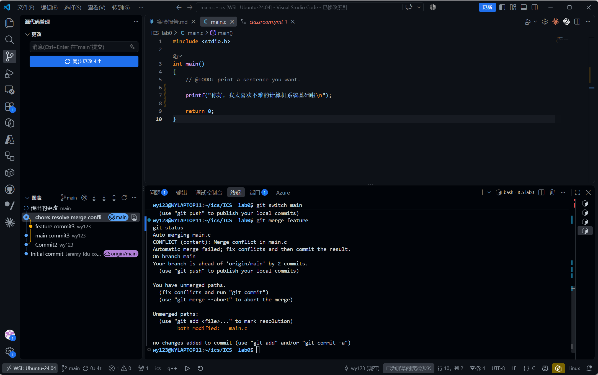
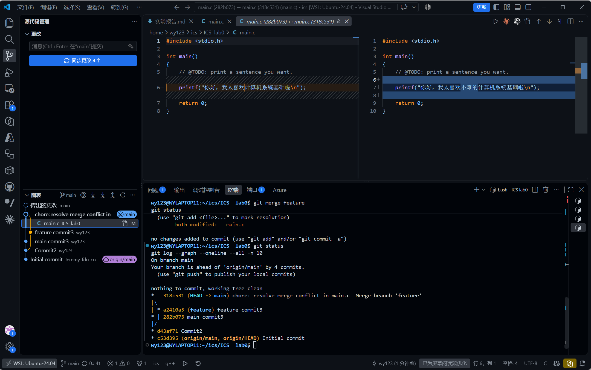

# Lab0：GitLab
## Q1
1.有过多人协同开发的经历
 通过GitHub在同一仓库建立不同branch团队成员分别开发功能，再合并到 main
 或者fork主仓库 修改项目，再向原项目pull request

2.代码中常常会有不同想法的修改，改动的用途不同，完成程度也不同。可能希望先记录已经完成的错误修复，继续完善报告，并保留调试输出供自己检查。暂存区让你能够选择：哪些改动已经准备好，应该进入下一次提交。暂存区准备提交的内容清单，同时保存这些内容的快照，未被暂存的修改会继续保留，供继续编辑，
这样组织提交，会带来几个实际好处：
• 方便审查：同学能集中检查某一个功能或修复。
• 方便定位问题：可以根据提交记录追查错误从哪个版本开始出现。
• 方便撤销：某项功能需要撤回时，更容易找到对应提交。
• 方便协作：提交说明与实际修改内容能够对应起来。
从工作区提交到暂存区，暂存区提供一次检查的机会，再确认无误后提交到远程仓库，暂存负责选择和整理，提交负责记录版本。 这两个步骤让开发者既能自由修改文件，又能把版本历史整理成清晰、完整、便于协作的提交。

3.git branch
只列出本地分支
git branch -a
列出本地分支和远程跟踪分支，-a 是 --all 的缩写
执行git branch
可能显示：lab1* main
表示本地有 lab1 和 main 两个分支，星号 * 表示当前所在的分支。
执行：git branch -a
可能显示：
 lab1* main
  remotes/origin/main
  remotes/origin/dev

### Q2
实验一：建立个人仓库并完成首次修改与提交
1. 在 GitHub 上使用课程提供的模板仓库创建个人仓库，并将个人仓库克隆到 Ubuntu 本地。​
2. 使用 VS Code 打开本地项目，找到 main.c，修改 TODO 对应的输出语句：​
printf("你好，计算机系统基础\n");
3. 保存文件

#### Q3
一、三个网页的内容概括
1.《Commit message 和 Change log 编写指南》
文章介绍了如何规范地编写提交说明。提交说明应清楚表达改动的内容和目的，可以采用 <type>(<scope>): <subject> 的格式，用 feat、fix、docs 等类型区分不同改动。规范的提交记录便于浏览历史、查找问题，也可以配合工具生成版本更新日志。

2.《Gitflow 使用规范》
文章介绍了一种组织团队开发的分支管理方案：master 保存正式发布的代码，develop 汇集开发成果，feature 用于开发新功能，release 用于发布前测试，hotfix 用于紧急修复线上问题。通过明确分支职责和合并流程，可以协调开发、测试与发布，并确保修复同步回后续开发版本。Gitflow 是一种协作方案,一次正常开发的流程
1. 从 develop 创建 feature，开发功能后合回 develop。
2. 功能齐备后创建 release，进行测试；测试发现的问题可以另建 bugfix 修复。
3. 测试通过，把 release 合入 master，并同步回 develop，为发布版本打标签。

3.《语义化版本 2.0.0》
该规范通过“主版本号.次版本号.修订号”表达软件变化：不兼容的公共接口修改递增主版本号，兼容的功能新增递增次版本号，兼容的问题修复递增修订号。它还规定了预发布版本、构建信息和版本排序规则，并要求已发布版本的内容保持不变。这有助于使用者判断升级的兼容性，管理软件依赖。必须遵守的规则
• 升级次版本号，修订号归零；升级主版本号，其余两项归零。
• 数字不能有前导零，例如 1.02.3 不合法。
• 已发布版本的内容不能修改；修正必须发布新版本。
• 0.y.z 表示初始开发阶段，接口可能随时变化；1.0.0 标志着公共 API 的稳定定义

二、对“为什么要学习 Git”的理解
我认为，学习 Git 的价值在于让代码的修改过程可追踪、可恢复，并支持有序协作。
对于个人学习，Git 可以保存每个阶段的成果。程序出现问题时，我们能够比较历史版本，寻找引入问题的改动；尝试新思路时，也可以使用分支保留不同方案。这样，实验和修改会更有依据。
对于团队开发，Git 帮助成员分别开展工作，再比较和合并各自的修改。清晰的提交说明还能帮助其他人理解改动原因，降低沟通和维护的成本。
学习 Git 需要培养规范的开发习惯：**提交时说明改动，协作时明确流程，发布时表达兼容性。**这些习惯能帮助我们更可靠地完成课程项目，也为参与团队开发和开源项目打下基础。

##### Q4
实验二：分支管理与合并冲突处理
1. 以 main 分支的已有版本为起点，新建 feature 分支。​
2. 在 feature 分支中修改 main.c 的某一行，保存并提交。随后切换回 main 分支，将同一行修改为不同内容，再保存并提交。这样，两个分支对共同版本中的同一位置产生了不同修改。​
3. 在 main 分支执行：​
git merge feature
合并时，终端出现：​
CONFLICT (content): Merge conflict in main.c
Automatic merge failed; fix conflicts and then commit the result.
git status 同时显示 both modified: main.c，说明 Git 无法自动合并该文件，需要手动处理冲突。我保存此时的文件内容和终端输出截图，作为冲突产生的证据。​
​
4. 打开 main.c，检查冲突标记之间的两份内容。其中，<<<<<<< HEAD 一侧对应当前 main 分支，另一侧对应 feature 分支。根据最终需要保留的内容编辑代码，删除冲突标记并保存文件。​
5. 执行以下命令，将处理后的文件加入暂存区并完成合并提交：​
git add main.c
git commit -m "chore: resolve merge conflict in main.c"
6. 使用以下命令检查仓库状态和提交历史：​
git status
git log --graph --oneline --all -n 10
确认工作区干净，并在提交图中查看两个分支的修改记录及合并提交。保存解决后的代码、仓库状态和提交图截图，作为冲突已解决的证据。

